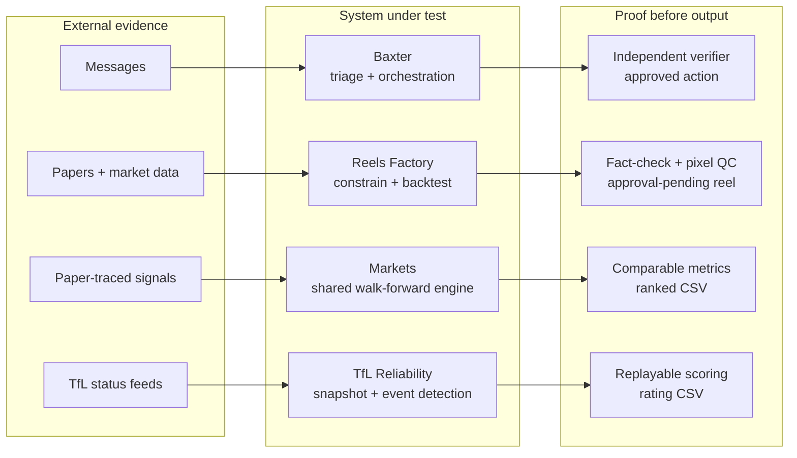

<picture>
  <source media="(prefers-color-scheme: dark)" srcset="assets/banner-dark.svg">
  
</picture>

# Systems that leave evidence

This is the source for my GitHub profile and an index of four end-to-end systems.
They turn messy external inputs into useful actions, media, experiments, or ratings.
The difficult part is the layer between those points: constrained models, replayable
data, independent checks, and human release gates.

I study Economics at UCL and build the engineering around decisions that need to be
explainable after the run, not just impressive during it.

## Featured builds

<table>
<tr>
<td width="50%" valign="top">

### [Baxter](https://github.com/LolStar123/baxter)

A personal chief-of-staff that pulls Gmail, Discord, WhatsApp, and voice notes
into one triage loop. A PRD gate controls self-directed builds; a separate
verifier checks completion claims before release.

`multi-channel intake` `gated builds` `independent verify`

</td>
<td width="50%" valign="top">

### [Reels Factory](https://github.com/LolStar123/reels-factory)

Turns a quant paper and market data into a backtested, voiced, captioned vertical
reel. Constrained strategy extraction, pixel-level QC, claim checking, and a
human decision file stand between research and publishing.

`paper -> strategy` `4-engine voice chain` `approval required`

</td>
</tr>
<tr>
<td width="50%" valign="top">

### [Markets Backtesting](https://github.com/LolStar123/markets-backtesting)

Runs 50 paper-traced signals through one walk-forward engine and writes
comparable risk metrics. In the published run, Conditional Risk Parity recorded
a 0.758 WF1 Sharpe and +1.96% in the held-out window.

`50 signals` `2 evaluation windows` `ranked metrics`

</td>
<td width="50%" valign="top">

### [TfL Reliability](https://github.com/LolStar123/tfl-reliability)

Collects Tube status snapshots into SQLite, detects changes, and reranks lines
with event-driven Elo-style updates. Ratings derive from stored snapshots, so
the same history can be replayed with new parameters.

`TfL Unified API` `SQLite history` `replayable ratings`

</td>
</tr>
</table>

## One operating pattern, four outputs



## Working set

`Python` / `pandas` / `numpy` / `PowerShell` / `SQLite` / `Streamlit` /
REST APIs / `ffmpeg`

## Inspect locally

This repository is the profile source, not an application. The complete local
inspection path is:

```powershell
git clone https://github.com/LolStar123/LolStar123.git
cd LolStar123
git ls-files
```

`README.md` holds the profile; [`assets/banner-dark.svg`](assets/banner-dark.svg)
and [`assets/banner-light.svg`](assets/banner-light.svg) hold the theme-aware hero.
Each featured-build link above leads to that system's own runnable quickstart.

Licensed under the [MIT License](LICENSE).

Contact: **atulswaggalicious@gmail.com**
